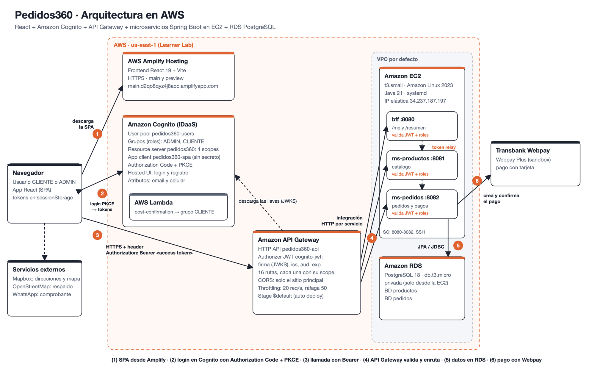

# Pedidos360

Proyecto de **Desarrollo Cloud Native I (DSY1107)**. Sistema de pedidos de comida con frontend React publicado en AWS Amplify, autenticación con Amazon Cognito como IDaaS, Amazon API Gateway como API Manager y microservicios Spring Boot en EC2 con PostgreSQL en Amazon RDS.

| | |
|---|---|
| **Sitio** | https://main.d2qo8qyz4j8aoc.amplifyapp.com |
| **API** | https://w7q276u1ka.execute-api.us-east-1.amazonaws.com (todas las rutas exigen un JWT de Cognito) |
| **Usuarios de prueba** | Se entregan al docente por AVA o correo. También se puede crear una cuenta desde el sitio. |

> Por autorización del docente se usa **Amazon Cognito** en lugar de Azure AD (MSAL). El frontend está hecho en **React** en lugar de Angular: `react-oidc-context` (sobre `oidc-client-ts`) cumple el rol de MSAL con el flujo Authorization Code + PKCE, un guard de rutas (`ProtectedRoute`), un interceptor de axios que adjunta el token y la lectura de roles y scopes desde los claims.

## Arquitectura



```
Navegador (React en Amplify Hosting, HTTPS)
   │  1. login OIDC: Authorization Code + PKCE ──► Cognito (Hosted UI) ──► Lambda post-confirmation
   │  2. Authorization: Bearer <access token>
   ▼
API Gateway (HTTP API) ── authorizer JWT: firma, iss, audience, exp y scope por ruta ── CORS
   │
   ├─ /api/bff/*        ──► bff           :8080 ─┐ token relay
   ├─ /api/productos/*  ──► ms-productos  :8081 ◄┤
   └─ /api/pedidos/*    ──► ms-pedidos    :8082 ◄┘──► ms-productos (precios)
                                │          └──► Transbank Webpay (pagos)
                                └── RDS PostgreSQL (BD productos / BD pedidos)
```

Cada microservicio vuelve a validar el JWT aunque API Gateway ya lo haya hecho (defensa en profundidad): firma RS256 contra el JWKS de Cognito, vigencia, `iss`, `client_id`/`aud` y `token_use=access`. Los roles salen de `cognito:groups` y los scopes de `scope`.

El detalle del login está en [`docs/flujo-login-pkce.png`](docs/flujo-login-pkce.png).

## Tecnologías

| Capa | Tecnología |
|---|---|
| Backend | Java 21, Spring Boot 4.1.1 (Web MVC, Security OAuth2 Resource Server, Data JPA, Validation, Actuator), Maven |
| Frontend | React 19, Vite 8, TypeScript, React Router, `react-oidc-context` + `oidc-client-ts`, axios, Leaflet |
| Base de datos | PostgreSQL 18 en Amazon RDS (H2 en memoria para desarrollo y pruebas) |
| Identidad | Amazon Cognito (user pool, grupos, resource server, Hosted UI, trigger Lambda en Python 3.12) |
| API Manager | Amazon API Gateway, tipo HTTP API, con authorizer JWT |
| Cómputo y hosting | Amazon EC2 (Amazon Linux 2023, systemd), AWS Amplify Hosting |
| Servicios externos | Transbank Webpay Plus (ambiente de integración), Mapbox Geocoding v6 con respaldo en Photon/OpenStreetMap |

## Seguridad

- **Login:** Authorization Code + PKCE (`code_challenge_method=S256`), con `state` contra CSRF y `nonce` contra la reutilización del ID token. La contraseña solo se escribe en el Hosted UI de Cognito.
- **App client público** (sin secreto). Solo permite el flujo *authorization code*; `ALLOW_USER_PASSWORD_AUTH` está deshabilitado. Access e ID token de 60 minutos, refresh token de 1 día y renovación automática antes del vencimiento.
- **API Gateway:** authorizer JWT (issuer = user pool, audience = client id) en todas las rutas, con un scope exigido por ruta. Sin token o con token inválido responde 401; sin el scope, 403. La única ruta pública es el retorno de Webpay (ver [Pagos](#pagos-y-entrega)).
- **Microservicios:** vuelven a validar el JWT y aplican el rol con `@PreAuthorize`. Sin sesión (*stateless*) y sin cookies. Errores en `application/problem+json`, y el 401 incluye `WWW-Authenticate`.
- **CORS:** solo el origen del sitio, solo los métodos y headers usados, sin credenciales.
- **Base de datos:** RDS sin acceso público; su security group solo acepta la EC2. Conexiones cifradas con TLS.
- **Secretos:** ninguno en el repositorio. La clave de la base vive en la EC2 (`/opt/pedidos360/pedidos360.env`, permisos 600) y en `infra/state.env` (ignorado por git).

## Roles y scopes

| Grupo Cognito | Rol | Puede |
|---|---|---|
| `ADMIN` | ROLE_ADMIN | CRUD de productos, ver todos los pedidos, cambiar estado, confirmar pagos manuales |
| `CLIENTE` | ROLE_CLIENTE | Ver catálogo, crear pedidos, ver y cancelar los propios, pagar con Webpay |

Quien se registra desde el sitio queda en `CLIENTE` gracias al trigger *post confirmation* (`infra/lambda/post-confirmation`). Si un token no trae grupo, el backend lo trata como `CLIENTE`.

Scopes del resource server `pedidos360`: `productos.read`, `productos.write`, `pedidos.read`, `pedidos.write`.

## Endpoints

| Método | Ruta | Servicio | Scope | Rol |
|---|---|---|---|---|
| GET | `/api/bff/me` | bff | (autenticado) | cualquiera |
| GET | `/api/bff/resumen` | bff | pedidos.read | cualquiera |
| GET | `/api/productos` | ms-productos | productos.read | cualquiera |
| GET | `/api/productos/{id}` | ms-productos | productos.read | cualquiera |
| POST | `/api/productos` | ms-productos | productos.write | ADMIN |
| PUT | `/api/productos/{id}` | ms-productos | productos.write | ADMIN |
| DELETE | `/api/productos/{id}` | ms-productos | productos.write | ADMIN |
| GET | `/api/pedidos` | ms-pedidos | pedidos.read | ADMIN: todos; CLIENTE: propios |
| GET | `/api/pedidos/{id}` | ms-pedidos | pedidos.read | dueño o ADMIN |
| POST | `/api/pedidos` | ms-pedidos | pedidos.write | CLIENTE o ADMIN |
| PATCH | `/api/pedidos/{id}/estado` | ms-pedidos | pedidos.write | ADMIN |
| POST | `/api/pedidos/{id}/cancelar` | ms-pedidos | pedidos.write | dueño (si está PENDIENTE) |
| PATCH | `/api/pedidos/{id}/pago` | ms-pedidos | pedidos.write | ADMIN (confirma transferencia o efectivo) |
| POST | `/api/pedidos/{id}/pago/webpay` | ms-pedidos | pedidos.write | dueño (inicia el pago con tarjeta) |
| GET, POST | `/api/pagos/webpay/retorno` | ms-pedidos | pública | retorno del navegador desde Webpay |

Respuestas de error: 400 validación, 401 token ausente o inválido, 403 sin rol o scope, 404, 409, 422 y 502.

## Pagos y entrega

- **Tarjeta:** Transbank **Webpay Plus**, ambiente de integración (documentación pública en transbankdevelopers.cl). `ms-pedidos` crea la transacción, el navegador paga en Webpay y vuelve a `/api/pagos/webpay/retorno`. La ruta es pública porque el navegador vuelve sin el token de Cognito; el backend no confía en la URL: confirma la transacción directamente con Transbank y solo marca el pedido como pagado si está `AUTHORIZED`, con `response_code` 0 y el mismo monto del pedido. Los datos de la tarjeta nunca pasan por Pedidos360.
  Tarjeta de prueba: `4051 8856 0044 6623`, CVV `123`, cualquier vencimiento futuro; en el banco simulado, RUT `11.111.111-1` y clave `123`.
- **Transferencia:** se muestran datos bancarios (ficticios) y un botón de WhatsApp con el mensaje del comprobante; un ADMIN confirma el pago.
- **Efectivo:** pago al recibir; un ADMIN lo confirma al entregar.
- **Dirección:** autocompletado con **Mapbox Geocoding v6** (buena numeración en Chile) y mapa Leaflet con el estilo oscuro de Mapbox. Si no hay token o Mapbox falla, se usa [Photon](https://photon.komoot.io) (OpenStreetMap, sin API key) con tiles de OpenStreetMap. Lo que escribe el usuario se conserva si el mapa no conoce el número exacto. Se guardan la dirección y las coordenadas.
- **Celular:** obligatorio en el registro de Cognito (`phone_number`) y en cada pedido.

## Pantallas

| Ruta | Acceso | Descripción |
|---|---|---|
| `/` | pública | Login: iniciar sesión o crear cuenta en el Hosted UI de Cognito |
| `/catalogo` | autenticado | Catálogo con búsqueda, categorías y ofertas |
| `/producto/:id` | autenticado | Detalle del producto |
| `/carrito` | CLIENTE o ADMIN | Carrito, dirección con mapa, celular y método de pago |
| `/pedidos` | autenticado | Seguimiento del pedido en curso, estado del pago e historial |
| `/perfil` | autenticado | Claims de los tokens y pruebas contra la API (token válido, sin token, token alterado) |
| `/admin` | ADMIN | Gestión de pedidos y pagos (indicadores desde el BFF) |
| `/admin/productos` | ADMIN | Mantenedor del catálogo |

## Estructura

```
backend/
  ms-productos/   catálogo (JPA + PostgreSQL/H2)
  ms-pedidos/     pedidos y pagos; consulta precios a ms-productos reenviando el token
  bff/            backend for frontend: /me y /resumen agregado
frontend/         React 19 + Vite + TypeScript
deploy/ec2/       units systemd, plantilla de variables y script de despliegue
infra/            scripts AWS CLI, Lambda de registro, estilo del Hosted UI y pruebas end-to-end
docs/             diagramas
```

Cada servicio del backend sigue la misma estructura por capas: `controller`, `service`, `repository`, `model`, `dto`, `exception` y `security`.

## Cómo se cumple la pauta

| Indicador | Dónde |
|---|---|
| EP1 · Login, logout, guards, interceptor, tokens, roles y scopes | `frontend/src/auth/`, `frontend/src/api/http.ts` |
| EP1 · El backend valida issuer, audience, firma, vigencia y roles | `backend/*/src/main/java/**/security/`, `@PreAuthorize` en los controladores |
| EP1 · Base de datos cloud (entidades, repositorios, conexión) | `model/`, `repository/`, `application.yml` (`DB_URL`) |
| EP2 · Rutas del API Manager, JWT por ruta y CORS | `infra/04-apigw.sh` |
| EP2 · Tenant, app client, resource server, registro y login | `infra/02-amplify-cognito.sh`, `infra/09-cognito-registro.sh` |
| EP2 · Authorization Code + PKCE, state y nonce | `frontend/src/auth/oidc.ts` |
| EP2 · Evidencia de cada ruta con y sin token | `infra/smoke-test.sh` |

## Ejecutar en local

Requisitos: JDK 21+ y Node 22+.

```bash
# Backend (cada uno en su terminal). Sin DB_URL usan H2 en memoria.
export COGNITO_ISSUER_URI=https://cognito-idp.us-east-1.amazonaws.com/<user-pool-id>
export COGNITO_CLIENT_ID=<app-client-id>
cd backend/ms-productos && ./mvnw spring-boot:run
cd backend/ms-pedidos   && ./mvnw spring-boot:run
cd backend/bff          && ./mvnw spring-boot:run

# Frontend (http://localhost:4200)
cd frontend && npm install && npm run dev
```

El frontend usa por defecto la API de AWS (`frontend/.env.development`). Como el CORS de producción solo acepta el sitio publicado, para desarrollar contra AWS hay que habilitar `localhost` con `CORS_DEV=1 infra/04-apigw.sh` (y volver a correrlo sin la variable al terminar). Para usar los backends locales, crear `frontend/.env.development.local` con `VITE_API_URL=` vacío: Vite reenvía `/api/*` a los puertos 8080 a 8082.

## Pruebas

| Qué | Cómo | Cantidad |
|---|---|---|
| Backend | `./mvnw test` en cada servicio (MockMvc con tokens simulados: 200, 201, 400, 401, 403, 404, 409, 422 y pagos con Webpay simulado) | 47 |
| Frontend | `npm test` en `frontend/` (Vitest) | 22 |
| End-to-end contra AWS | `infra/smoke-test.sh`: obtiene tokens reales con PKCE y prueba cada ruta sin token, con token alterado, como CLIENTE y como ADMIN | 25 verificaciones |

## Variables de entorno

### Backend

| Variable | Uso | Default local |
|---|---|---|
| `COGNITO_ISSUER_URI` | Issuer del user pool | placeholder |
| `COGNITO_CLIENT_ID` | App client permitido (separados por coma si son varios) | placeholder |
| `DB_URL`, `DB_USER`, `DB_PASSWORD` | Conexión a PostgreSQL | H2 en memoria |
| `PRODUCTOS_URL`, `PEDIDOS_URL` | URLs internas entre servicios | `localhost:8081` / `localhost:8082` |
| `PORT` | Puerto HTTP | 8080 / 8081 / 8082 |
| `WEBPAY_BASE_URL`, `WEBPAY_COMMERCE_CODE`, `WEBPAY_API_KEY` | Ambiente y credenciales de Transbank | ambiente de integración con sus credenciales públicas |
| `WEBPAY_RETURN_URL` | Ruta pública de API Gateway a la que vuelve el navegador desde Webpay | `localhost:8082` |
| `FRONTEND_ORIGINS` | Sitios a los que se puede devolver al cliente después de pagar | `http://localhost:4200` |

### Frontend

| Variable | Uso | Archivo |
|---|---|---|
| `VITE_API_URL` | URL de API Gateway (vacía en local = proxy de Vite) | `.env.production`, `.env.development` |
| `VITE_COGNITO_AUTHORITY`, `VITE_COGNITO_CLIENT_ID`, `VITE_COGNITO_DOMAIN`, `VITE_COGNITO_SCOPE` | Configuración OIDC de Cognito (valores públicos) | `.env.production`, `.env.development` |
| `VITE_MAPBOX_TOKEN` | Token público de Mapbox (`pk.…`). Opcional: sin él se usa OpenStreetMap | `.env.production.local`, `.env.development.local` (**no se versionan**) |

## Despliegue en AWS (Learner Lab)

CloudFront está bloqueado en AWS Academy, así que el frontend se publica en **Amplify Hosting**, que entrega HTTPS (Cognito lo exige en las URLs de callback).

Los scripts de `infra/` usan el perfil `dce1` (`~/.aws/dce1-env.sh`) y guardan los IDs creados en `infra/state.env` (ignorado por git, incluye la clave de la BD y la de los usuarios de prueba).

| Script | Crea o hace |
|---|---|
| `01-network-rds.sh` | Security groups y RDS PostgreSQL (privado, solo accesible desde la EC2) |
| `02-amplify-cognito.sh` | App de Amplify; user pool, grupos ADMIN/CLIENTE, resource server `pedidos360` con 4 scopes, app client público (Auth Code + PKCE), dominio del Hosted UI y usuarios de prueba |
| `03-ec2.sh` | EC2 t3.small (Amazon Linux 2023 + Corretto 21) con Elastic IP |
| `04-apigw.sh` | HTTP API con CORS (solo el sitio principal; `CORS_DEV=1` agrega preview y localhost), authorizer JWT de Cognito y una ruta por endpoint con su scope |
| `05-deploy-backend.sh` | BD `pedidos`, variables de entorno en la EC2 y despliegue de los 3 servicios con systemd |
| `06-deploy-frontend.sh` | Build de producción de React y publicación en Amplify (`BRANCH=preview` publica un ambiente de revisión) |
| `08-cognito-ui.sh` | Logo y colores de Pedidos360 en el Hosted UI de Cognito (`infra/cognito-ui/`) |
| `09-cognito-registro.sh` | Lambda *post confirmation* que agrega a cada usuario registrado al grupo CLIENTE |
| `get-token.sh` | Obtiene un access token recorriendo el flujo Authorization Code + PKCE del Hosted UI |
| `smoke-test.sh` | Evidencia end-to-end: cada ruta sin token, con token alterado, como CLIENTE y como ADMIN |

Las credenciales del lab expiran cada ~4 horas; al reiniciar el lab hay que volver a pegarlas en `~/.aws/credentials_aws_dce1`. La EC2 y RDS se detienen junto con el lab; la Elastic IP mantiene válidas las integraciones de API Gateway y los servicios arrancan solos con systemd al encender la instancia.

## Flujo de trabajo

- `main`: versión estable y publicada. Cada versión tiene su tag (`v1.0.0` … `v1.2.7`).
- `dev`: integración.
- `feature/*`, `fix/*`, `chore/*`, `docs/*`: una rama por cambio, que sale de `dev` y vuelve por Pull Request.

`dev` se promueve a `main` por Pull Request cuando está estable, y se despliega desde `main`.
